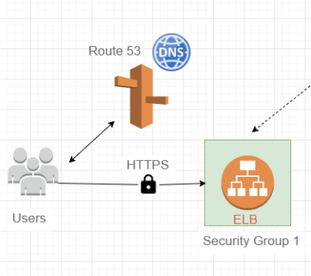
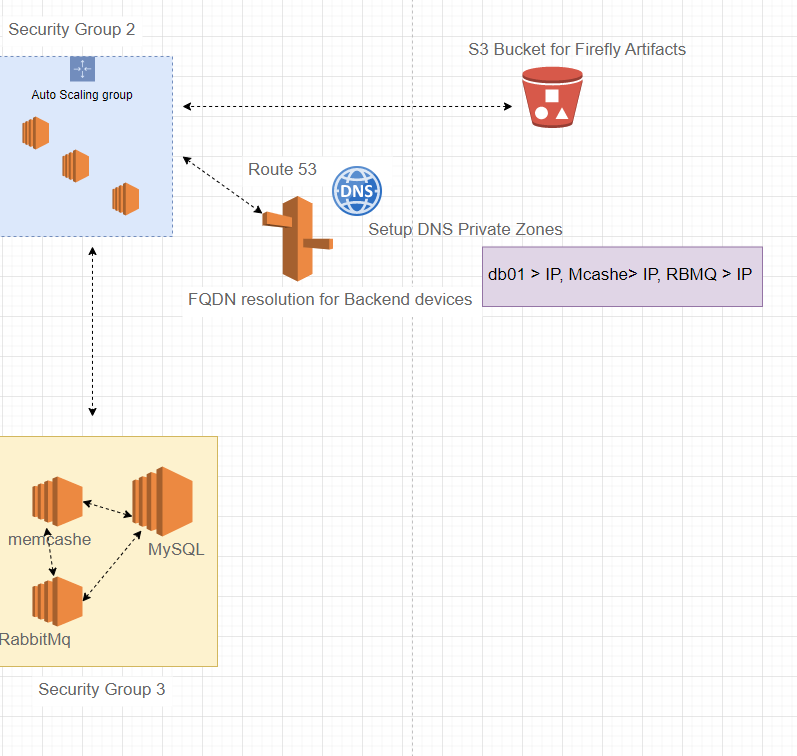

# Question 1 Solution

# Deployment of Firefly III for Personal Finance Manager System: this system helps to keep track of personal expenses and income, so that you can spend less and save more. For my quick reference I reviewed some documentations online to understand how the systems works and the available setup or deployment options and in summary if you want to have a beautiful insight into and control over your finances then try Firefly III.

## After having an overview  of the Firefly III systems I had to review the deployment options which are on Docker, Kubernetes, Self-hosted, platforms, 3rd parties but in my deployment case I will be using the self-hosted server option for the deployment.

## from the documentation online, Firefly III will require a webserver, a database server since it is written in PHP, so we will have to setup these services as well. using the system architecture below for a coporate organisation setup with the expectation that so many staff will be accessing the system globally.

## another option is we could use a complete SaaS or PaaS service from AWS for the deployment. more like re-architecting or refactoring the above design to look more like the screenshot below

## I will use the first design in this case an IaaS kind of architecture from AWS is employed for the deployment

## since the DNS is setup using Route 53, we can easily make use of AWS core specific services for the deployment option although other options can be useds as well from other vendors. the Amazon certificate manager will also be employed since it should be a secure site deployment to help authenticate communication between the browser and the webserver

## the ELB will act as the end point to the URL launched from the browser to access the Firefly III app on Nginx webserver

## From the documentation an Nginx webserver can be used to provide response to the request to access the application from the users. hoever, in this case I will be using ELB to route request to different VM 

## I will also setup  an autoscaling group for the VM for VM scaling automation incases where there may not really be high request from users or times where there could be high requests from users.

## I will provision the Nginx on EC2 instances with the Auto scaling group as well with the right Operating system AMI and ensure it allows traffic from the security group of the Elastic load balancer uisng port 8080

## with this, the front end part of the FireFly III application will now be setup, we are now left with the back end side

## for the back end side I will deploy services such as RabbitMq for rapid request of webservers and memcashe for data cashing request sent to the MySQL database which will be the third service deployed at the back end to complete the back end setup.

## The Amazon Route 53 used for the company's domain will be used to setup the DNS private zones for the backend services for efficient FQDN resolution fr the different EC 2 instances.

## the artifacts for the firefly III will be stored within S3 buckets for access to the front-end Nginx instances

## Simple flow of execution summary can be viewed below

`Access the AWS account`

`create necessary key pairs for instances to be launched`

`create the secuity groups`

`instances can be launched with user data scripts - bash scripts`

`Update IP to name mapping in Route 54 for the instances`

`build Firefly III application from source code in Git Repo`

`Upload to S3 bucket`

`Download artifact to Nginx EC2 instance`

`setup ELB with HTTPS probably maybe using Cert from Amazon certificatye magnagaer secure connection the resources`

`map elb endpoint to firefly III websit name in Route 53`

`then verify access to app for users with Gsuite account setup`

## in cases where other employees may need to access from other region then there may be a need to setup Amzon CloudFront CDN to cashe information for effieceint transfer of traffic

## there is the possibility of defining these task in a template that can be uploaded using different IaaC tools like Teraform or Cloudformation for the deployment of the different resources but since I am going with the AWS deployment Option i can easily deploy this using Cloudformation

# Question 2: 

## Will be working on Automating User access for access to the system by going through the steps below

## I will be setting up the accounts using Identity Access Management service - IAM on AWS

## And to make the process seamless and easy i will be using CloudFormation IaaC to build the template for the creation of users and also adding the users to groups and giving them necessary permission to required resources with AWS for access.

## I will start by creating a one time password entry to pass in the value of a password for the user before he changes the password after logon. this is defined under the parameter section of the script seen below

## then will create actual resources, and i will start by creating the first user and define the type of user and the username 

## in this case I'm using exampleuser1 as the username of the staff and also specify the one time password for first login and ensure password reset is enabled as well after logon to create for more users we can repeat the excerpt for exampleuser1 and repeat same for addition users, 

## there are tricks with visual studio to hasten the process by highlighting  the user and press CTRL-d to update to another user propagate same for additional accounts to be be created.

## we can now add a group to the top of the user account created with resource name 

## then create a policy to provide access to relevant data to the group and link it the group with the required reference policy used rules can be used to grant permission to other resources within AWS were necessary

## then within the policy definition specific permission can be assigned to different resources once the group is properly defined then we can tie a user to the group in the case below exampleuser1 has been added to the admin group

## the additiona cloudformation template script can be seen below

## then from cloudFormation within AWS  we can create a stack to upload the template

## and we can create the one time password to be used for the first time as well when the user tries to logon

## the cloudformation stack can also be named before upload.

## then we can click on create stack from template.

## and the groups and users created can be viewed. and the accounts can also be tested for resources they have access to withing the AWS resources setup for firefly III.

## also note that cloudformation is not Idempotent as it runs with an error when same file is executed continously unlike Terraform and anisble that are idempotent

# Question 3

## Applications would need to have system and audit logs records and monitoring. The logs are collected via Amazon CloudWatch. Create the usecase for system and audit logs and describe the logs collection and alerting implementation.

## Cloudwatch can be used to collect the logs from the application and some metrics can be used to create a dashboard that cn be reviewed to understand the state of the application

## Also note that for better instance performance the log files can be transfered to S3 bucket for archiving so that there is available disc space in the EC2  instance for better performance

## the design of how cloudwatch can be setup is seen below

## its good to know that CloudWatch creates some metrics automatically after a resource is added. some metrics can be viewed from the screenshot below

## You can customize other non-existing metrics

## By default CloudWatch updates the metrics every 5 minutes. but we can enable what is called detailed monitoring as well.

## In this case i will log in to the VM and try to stress the VM to view the metrics of the VM resources. we can stress it using the scripts below depending on the OS AMI

## please note that stress is process that will stress different resources of the EC2 system

## STRESS Installation
## Centos

`sudo yum install epel-release -y`

`sudo yum install stress -y`

## Amazon Linux 2

`sudo amazon-linux-extras install epel -y`

`sudo yum install stress -y`

## Ubuntu
`sudo apt update`

`sudo apt install stress -y`

## stress command

`stress -c 4 -t 60 && sleep 60 && stress -c 4 -t 60 && sleep 60 && stress -c 4 -t 360 && sleep  && stress -c 4 -t 460 && sleep 30 && stress `

## after testing that we can navigate to cloudwatch and click on alarms within AWS

## the alarms options can be used to notify a user when there is an abnomality in behavior for any of the resources used. lets say it been below or above a certain threshold. these notification can be sent to our coporate gmail accounts setup on GSuite

## CloudWatch Logs Insights enables you to interactively search and analyze your log data in Amazon CloudWatch Logs to know what is happening within the system.

## so we will create some logs within the instance application and see how we can stream it through the application

## a cloud watch agent will be setup on the resources where logs will be accessed from

## we will follow the implementation step below

## setup IAM Policy and attcah the EC2 system to the policy or existing IAM policies in the system can be used for this. this can be managed using cloudformation or terraform using the script below to setup the IAM policy

`{
"Versions "date"
"statement" :[
}
"Effect": "Allow"
"Action": [
"logs:CreateLogGroup",
"logs:CreateLogStream"'
"logs:PutLogEvents",
"logs:DescribeLogStreams"
],
"Resource":[
"arn:aws:logs:*:*:*"
]
}
]
}`

## while setting up the instance I will attch the instance to an IAM role, this is more secured than creating a user that will be used and the access and secret key can be easily exposed

## please note that an IAM role is not for humane access to resouces but giving other resources permissions to other resources with AWS

## Install cloudwatch agent in the instance using the scripts, the agent will assist to take logs from the instance to the cloudwatch service

`sudo yum update -y`

`sudo yum install -y awslogs`

## then configure cloudwatch agent configuration file by editing 

`vim /etc/awslogs/awscli.conf`

## I edit the above file to setup the appropriate AWS region

`vim /etc/awslogs/awslogs.conf` 

## I edit the above file as per the logs configurations below

## then start the aws agent

`sudo service awslogs start`

## create dummy log file at the location you can configured in the file and keep appending some data (e.g create and append data in /var/logapplication.log file)

## then we can verify we can see logs in CloudWatch logs console

## we can create a log filter and then....

## then we can create the metrics.

## An alarm can also be setup for when counts is more than a certain number then it sends an alarm to the cofigured GSuite email account.

## thats my Answer to the 3 questions

